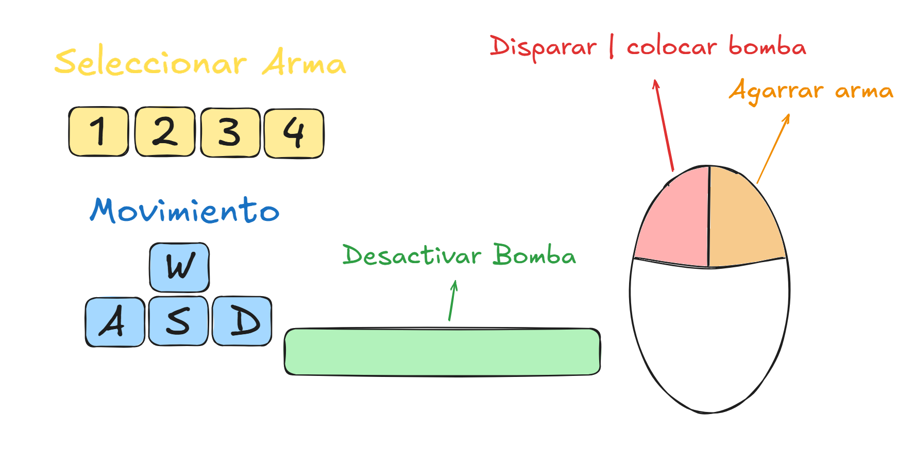

# 🧾 Manual del Usuario – Counter Strike 2D

## 📌 Introducción

Bienvenido al manual de usuario de Counter Strike 2D, un videojuego multijugador por rondas basado en el clásico Counter Strike, desarrollado íntegramente en C++ durante el curso de Taller de Programación I.\
Este documento tiene como objetivo guiarte paso a paso en la instalación, configuración y uso del software.

## 👨‍💻 Desarrolladores

- **Sebastián Kraglievich** – 109038
- **Agustin Perez Romano** – 109367
- **Morena Sandroni** – 110205
- **Mateo Bulnes** – 106211

## 🖥️ Requisitos del sistema

- **Sistema operativo compatible:** Ubuntu 24.04 / Xubuntu 24.04
- **Dependencias necesarias:**
  - SDL2 (v2.30.8)
  - SDL2_image (v2.8.2)
  - SDL2_mixer (v2.8.0)
  - SDL2_ttf (v2.22.0)
  - Qt (v6+)
  - yaml-cpp (v0.7.0)
  - CMake (3.28.3)
  - GCC con soporte para C++20

## 📦 Instalación (usando el instalador)

Contamos con un instalador automatizado que facilita todo el proceso.

▶️ **Paso a paso:**

1. **Instalar Git**\
   Si no lo tienes, abre una terminal y ejecuta:

   ```bash
   sudo apt update
   sudo apt install git
   ```

2. **Clonar el repositorio**

   ```bash
   git clone https://github.com/Sebakrag/taller-CounterStrike.git
   cd taller-CounterStrike
   ```

3. **Ejecutar el instalador**

   ```bash
   chmod +x install.sh
   sudo ./install.sh
   ```

   Este script:

   - Instala dependencias necesarias.
   - Compila el proyecto.
   - Ejecuta los tests.

## ⚙️ Configuración

Antes de ejecutar el juego, verifica el archivo:

```
/server/config.YAML
```

Este contiene parámetros como vida máxima, balas, daño, tiempos, etc.\
Modificando este archivo podrás personalizar muchas características del juego.

## 🚀 Cómo ejecutar el juego

### Con instalador

- **Editor de mapas**

  ```bash
  CounterStrike-editor
  ```

  Permite crear y editar mapas personalizados (guardados en `/server/maps`).

- **Levantar el servidor**

  ```bash
  CounterStrike-server 8080
  ```

  Inicia el servidor de partidas multijugador.

- **Ejecutar el cliente**

  ```bash
  CounterStrike-client
  ```

  Desde aquí podrás:

  - Loguearte y conectarte al servidor.
  - Crear o unirte a partidas.
  - Jugar.

### Compilación manual

1. **Compilar**

   ```bash
   make compile-debug
   ```

2. **Editor de mapas**

   ```bash
   ./build/taller_editor
   ```

3. **Levantar el servidor**

   ```bash
   ./build/taller_server 8080
   ```

4. **Ejecutar el cliente**

   ```bash
   ./build/taller_client
   ```

## 🕹️ Cómo se juega

1. **Levantar un servidor**

   - Si juegas en LAN: basta con `localhost`.
   - Si juegas por Internet: abre el puerto en tu router.

2. **Conexión al servidor**

   - **Nombre de Usuario:** tu nick.
   - **Servidor:** `localhost` o IP remota.
   - **Puerto:** e.g., `8080`.

3. **Menú**

   - **Crear una partida:** define nombre y mapa, y serás host.
   - **Unirse a una partida:** elige de la lista disponible.
   - **Salir:** desconecta y cierra el juego.

4. **Lobby**

   - Lista de jugadores por equipo.
   - Puedes salir; el host puede iniciar la partida.
   - Si el host abandona, otro jugador asume el rol.

5. **Partida**

   

   - **Objetivos:**
     - Terroristas: plantar y defender la bomba.
     - Antiterroristas: evitar la plantación o desactivar la bomba.
   - **Final de ronda:**
     - Eliminación total de un bando.
     - Bomba explota o es desactivada.
     - Tiempo límite agotado.
   - **Fases de cada ronda:**
     1. **Preparación:** compra armas y munición.
     2. **Combate:** libre movimiento y combate.
        
    

6. **Controles en combate**
   - `WASD`: moverte.
   - Mouse: apuntar y clic izquierdo para disparar.
   - `1, 2, 3…`: cambiar arma; `4` equipa la bomba.
   - Clic derecho al pasar sobre un arma en el suelo para recoger/intercambiar.
   - Plantar bomba: clic izquierdo en zona habilitada.
   - Desactivar bomba: posiciónate sobre ella y presiona `ESPACIO`.
     

## 🛠️ Editor de niveles

El editor te permite crear mapas personalizados:

- **Panel izquierdo:**

  - **Tiles:** terreno, obstáculos, spawn zones, zona de bomba.
  - **Armas:** elementos para colocar.
  - **Zoom:** in/out.
  - **Archivo:** guardar y preajustar mapa.

- **Área derecha:** lienzo de mapa donde colocas tiles y armas.

### Uso

1. Selecciona un elemento en la barra lateral.
2. Haz clic en el lienzo para colocarlo (o arrastra para “pintar”).
3. Al terminar, pulsa **Guardar** e ingresa un nombre.
   - Debes haber colocado spawn points para ambos equipos y la zona de bomba.
4. Tu mapa aparecerá en la lista al crear una partida en el juego.
